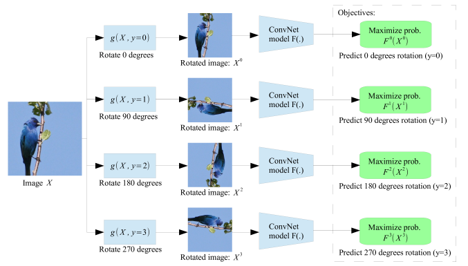
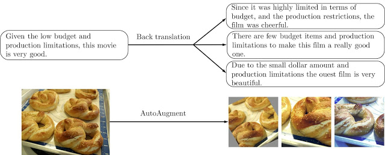
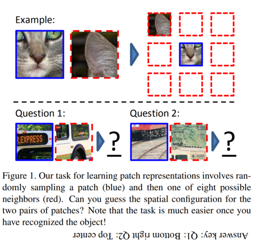
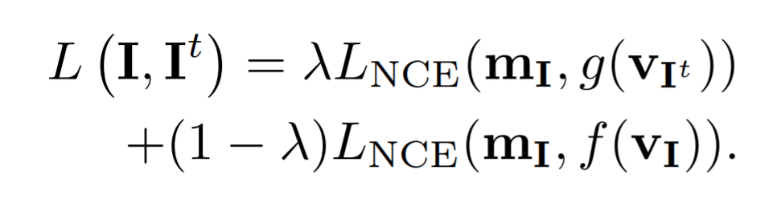
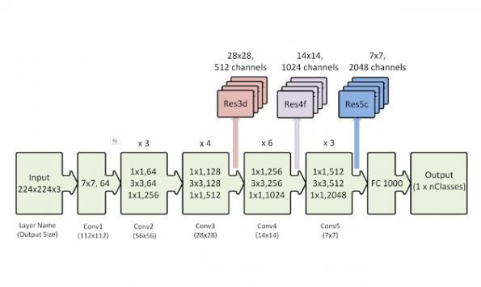

## Intro

Scott Mueller

###### smueller.tampa.ai@gmail.com

---
## Tampa.ai

Looking for Presenters

---
## Self-Supervised Learning of Pretext-Invariant Representations

https://arxiv.org/abs/1912.01991

---
## Why Semi-Supervised Pretext Training?
---
## Covariant Tasks

a pretext task that applies a
transformation to the input image and requires the learner
to predict properties of the transformation from the transformed image 

---
## Covariant Example

---
## Invariant Tasks

invariant under image transformations to be useful for
image recognition because the transformations do
not alter visual semantics
---
## Invariant Example

https://ai.googleblog.com/2019/07/advancing-semi-supervised-learning-with.html
---
## Pretext-Invariant Representation Learning

Pretext-Invariant Representation Learning (PIRL) constructs image representations that are similar to the representation of transformed versions of the same image and
different from the representations of other images.

---
## Jigsaw Task

---
## PIRL Approach

train a convolutional network,
φθ(·), with parameters θ that constructs image representations vI = φθ(I) that are invariant to image transformations
t ∈ T . We adopt an empirical risk minimization approach
to learning the network parameters θ. Specifically, we train
the network by minimizing the empirical risk

---
## Loss Approach

loss function that measures the similarity between two image
representations. Minimization of this loss encourages the
network φθ(·) to produce the same representation for image
I as for its transformed counterpart I't
, i.e., to make representation invariant under transformation t

---
## Loss Function

a contrastive loss function L(·, ·) [22]. Specifically, we define a matching score, s(·, ·), that measures the similarity of two image
representations and use this matching score in a noise contrastive estimator

---
## Noise Constrastive Estimator

Noise Contrastive Estimation is a way of learning a data distribution by comparing it against a noise distribution, which we define. This allows us to cast an unsupervised problem as a supervised logistic regression problem. 

---
## Negative Sampling

an approximation mechanism that was invented to reduce the computational cost of normalizing network outputs by summing over the entire vocabulary. 

https://www.kdnuggets.com/2019/07/introduction-noise-contrastive-estimation.html

---
## Pytorch NCE

https://github.com/Stonesjtu/Pytorch-NCE

https://github.com/kefirski/pytorch_NEG_loss

https://medium.com/towardsdatascience/word2vec-negative-sampling-made-easy-7a1a647e07a4

---
## Similar to transformation of itself - Different from Others

This loss encourages the representation of image I to be
similar to that of its transformed counterpart I^t
, whilst also
encouraging the representation of I^t
to be dissimilar to that
of other images I'

---
## Memory Bank Negative Samples

Prior work has found that it is important to use a large
number of negatives in the NCE loss.  In a mini-batch SGD optimizer, it is difficult to obtain a
large number of negatives without increasing the batch to
an infeasibly large size

---
## memory bank of “cached” features

The memory bank, M, contains a feature representation
mI for each image I in dataset D. The representation mI
is an exponential moving average of feature representations
f(vI) that were computed in prior epochs. This allows us to
replace negative samples, f(v'I), by their memory bank representations, mI' , in Equation 4 without having to increase
the training batch size

Concurrent work used similar memory bank
---
## Final Loss Function

A potential issue of the loss in Equation 4 is that it does not compare the representations of untransformed images I and I'. We address this issue by using
a convex combination of two NCE loss functions

---
The first term is simply the loss of Equation 4 but
uses memory representations mI and mI'
instead of f(vI)
and f(v'I), respectively. The second term does two things:
(1) it encourages the representation f(vI) to be similar to
its memory representation mI, thereby dampening the parameter updates; and (2) it encourages the representations
f(vI) and f(v'I) to be dissimilar
---
## Any Transformation
 PIRL can be used with any pretext task that involves image transformation
---
## Different Heads

do not use the convolutional features v
directly but apply to different “heads” to the features before
computing the score s(·, ·). Specifically, we apply head f(·)
on features (vI) of I and head g(·) on features (vI^t ) of I^t
---
## Different Heads

 compute an image representation for each patch separately by extracting activations
from the res5 layer of the ResNet-50 and average pool
the activations, (3) apply a linear projection to obtain a
128-dimensional patch representations, and (4) concatenate
the patch representations in random order and apply a second linear projection on the result to obtain the final 128-dimensional image representation

---
## Res5

https://towardsdatascience.com/understanding-and-visualizing-resnets-442284831be8

---
## Res5 again

https://www.researchgate.net/figure/Left-ResNet50-architecture-Blocks-with-dotted-line-represents-modules-that-might-be_fig3_331364877

---
## Hyperparameters Memory Bank

temperature in Equation 3 to τ = 0.07, and use a weight of 0.5 to compute the
exponential moving averages in the memory bank. Unless
stated otherwise, we use λ= 0.5 

---

---

[Knowfalls.com](https://knowfalls.com/team.html)

###### scottmueller@knowfalls.com

Looking for Founder Engineers

Elixir, Functional Programming, Rails, Experience

---
Early Fast.ai V2 Walkthrough Lessons

https://forums.fast.ai/t/a-walk-with-fastai2-study-group-and-online-lectures-megathread/59929